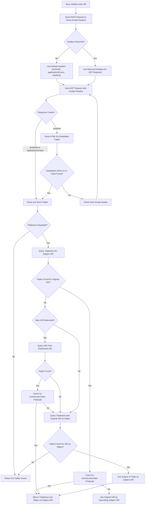
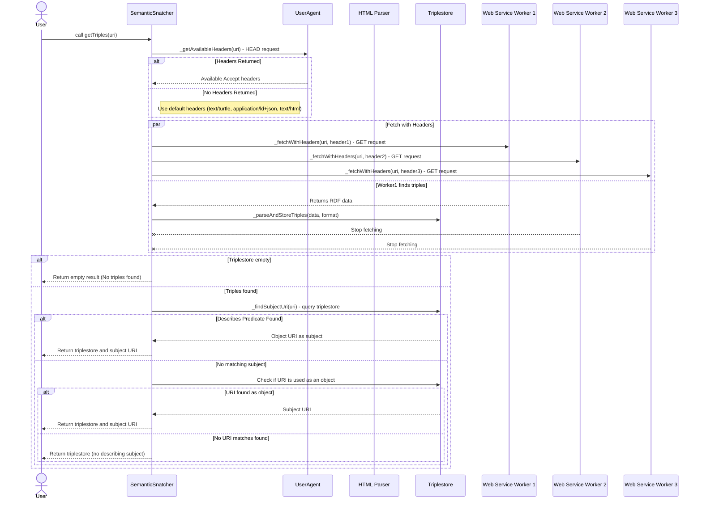
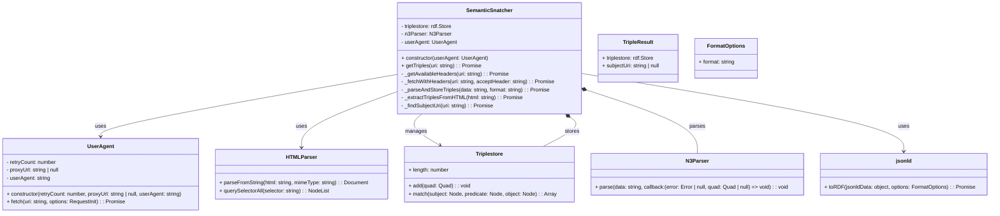

# semantic-snatcher

a deno project that will extract triples and a object URI from a given source URI

### Step-by-Step Plan for the semantic snatching

#### 1. **Initialize Function**

- Input: A URI that will be used to retrieve triples.
- Output: A triplestore and the subject URI that describes the object (if found).

#### 2. **Perform Preflight `HEAD` Request**

- **Send a `HEAD` request** to the URI to check available `Accept` headers.
- **If available headers are returned**, note them for subsequent GET requests.
- **If no headers are returned**, use default Accept headers:
  - `text/html`, `text/turtle`, `application/ld+json`.

#### 3. **Retrieve Initial Triples (with GET requests)**

- **3.1 Send HTTP GET Request with determined Accept headers:**
  - For each header type, send a `GET` request to try and retrieve triples.
  - **If a response with `text/turtle` or `application/ld+json` is successful**:
    - Parse the content and add it to the triplestore.
    - **Exit this step** if triples are found.
  - **If `text/html` is used**:
    - Parse for embedded `application/ld+json` or `text/turtle` in the HTML.
    - Look for JSON-LD content in `<script>` tags or `<link>` tags.
    - If found, fetch content, parse JSON-LD, and add it to the triplestore.
  - **If no triples are found** in all Accept headers, exit the function without a triplestore.

#### 4. **Check if Triples Are Found**

- If the triplestore is empty, terminate the function.
- If triples are found, proceed to find the `subject URI` within the triplestore.

#### 5. **Query Triplestore for Subject URI**

- Use the original URI as the subject in a query.
- If triples are returned, check for `schema:describes`.
- If no results, query the triplestore using the final redirected URI if applicable.

#### 6. **Return Results**

- Return the populated triplestore and the determined `subject URI`.



---

### Sequence Diagram Description

1. **User/System** invokes the function with an initial URI.
2. **Function** sends HTTP GET requests with specified Accept headers (`text/turtle`, `application/ld+json`, and `text/html`).
   - For each response, it tries to parse and store triples in the triplestore.
   - If `text/html` is used, **HTML Parser** looks for embedded JSON-LD or Turtle content.
3. **Function checks the triplestore** to see if triples were found:
   - If empty, **returns** without data.
   - If populated, proceeds to subject URI search.
4. **Function performs query** with the original URI as the subject:
   - If successful, checks for `schema:describes`.
   - If found, uses the triple’s object as the `subject URI` and **returns the triplestore and subject URI**.
5. If no relevant triples are found and if there were redirects:
   - **Function performs query with the final redirected URI** as the subject.
6. If still no results, **Function performs query using the URI as an object**.
7. If triples are returned, uses the subject of the triple as the `subject URI`.
8. **Return Result**:
   - Function returns the `triplestore` and the determined `subject URI`.



---

# Class Diagram Description for the Semantic Snatcher



---

### Pseudocode

```typescript
class SemanticSnatcher {
  private triplestore: rdf.Store;
  private n3Parser: N3Parser;
  private userAgent: UserAgent;

  constructor(userAgent: UserAgent) {
    this.userAgent = userAgent;
    this.triplestore = new rdf.Store();
    this.n3Parser = new N3Parser();
  }

  async getTriples(uri: string): Promise<TripleResult> {
    const headers = await this._getAvailableHeaders(uri);
    const defaultHeaders = ["text/html", "text/turtle", "application/ld+json"];
    const acceptHeaders = headers.length ? headers : defaultHeaders;

    const workers = acceptHeaders.map((header) =>
      this._fetchWithHeaders(uri, header).catch(() => null)
    );
    const result = await Promise.race(workers.filter((p) => p !== null));

    if (result) {
      await this._parseAndStoreTriples(result.data, result.format);
    }

    if (this.triplestore.length === 0) {
      return { triplestore: this.triplestore, subjectUri: null };
    }

    const subjectUri = await this._findSubjectUri(uri);
    return { triplestore: this.triplestore, subjectUri };
  }

  private async _getAvailableHeaders(uri: string): Promise<string[]> {
    // Send HEAD request to get available headers
    const response = await this.userAgent.fetch(uri, { method: "HEAD" });
    if (response && response.headers.has("Accept")) {
      return response.headers.get("Accept").split(",");
    }
    return [];
  }

  private async _fetchWithHeaders(
    uri: string,
    acceptHeader: string
  ): Promise<{ data: string; format: string } | null> {
    const response = await this.userAgent.fetch(uri, {
      headers: { Accept: acceptHeader },
    });
    if (response && response.ok) {
      const data = await response.text();
      return { data, format: acceptHeader };
    }
    return null;
  }

  private async _parseAndStoreTriples(
    data: string,
    format: string
  ): Promise<void> {
    if (format === "text/turtle" || format === "application/ld+json") {
      this.n3Parser.parse(data, (error, quad) => {
        if (quad) {
          this.triplestore.add(quad);
        }
      });
    } else if (format === "text/html") {
      await this._extractTriplesFromHTML(data);
    }
  }

  private async _extractTriplesFromHTML(html: string): Promise<void> {
    const doc = new HTMLParser().parseFromString(html, "text/html");
    const scripts = doc.querySelectorAll('script[type="application/ld+json"]');
    for (const script of scripts) {
      const jsonldData = JSON.parse(script.textContent);
      const rdfData = await jsonld.toRDF(jsonldData, {
        format: "application/n-quads",
      });
      this.n3Parser.parse(rdfData, (error, quad) => {
        if (quad) {
          this.triplestore.add(quad);
        }
      });
    }
  }

  private async _findSubjectUri(uri: string): Promise<string | null> {
    const triples = this.triplestore.match(uri, "schema:describes", null);
    if (triples.length > 0) {
      return triples[0].object.value;
    }
    return null;
  }
}
```
