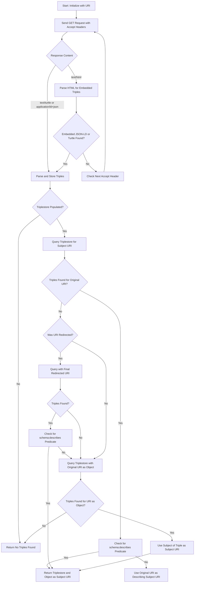
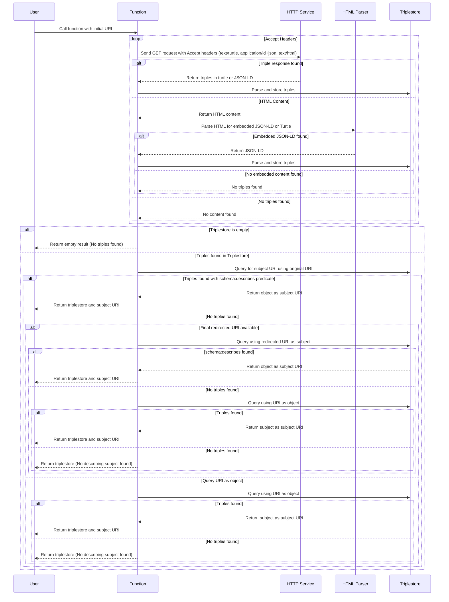

# semantic-snatcher

a deno project that will extract triples and a object URI from a given source URI

### Step-by-Step Plan for the semantic snatching

#### 1. **Initialize Function**

- Input: A URI that will be used to retrieve triples.
- Output: A triplestore and the subject URI that describes the object (if found).

#### 2. **Retrieve Initial Triples**

- **2.1 Send HTTP GET Request with Accept Headers:**
  - **First Accept Header:** `text/turtle`
  - **Second Accept Header:** `application/ld+json`
  - **Third Accept Header:** `text/html`
- **2.2** For each response, check:
  - **If `text/turtle` or `application/ld+json` is successful** (contains triples):
    - Parse the content and add it to the triplestore.
    - **Exit this step** if triples are found.
  - **If `text/html` is used**:
    - Parse for embedded `application/ld+json` or `text/turtle` in the HTML.
    - **Look for JSON-LD content in `<script>` tags**:
      - `<script>` tag with `type="application/ld+json"`.
      - **Or** `<link>` tag with `rel="describedby"` and `type="application/ld+json"`.
    - If found, **fetch content**, parse JSON-LD, and add it to the triplestore.
  - **If no triples are found in all Accept headers**, exit the function without a triplestore.

#### 3. **Check if Triples Are Found**

- If the triplestore is empty after Step 2, **terminate** the function.
- If triples are found, proceed to find the `subject URI` within the triplestore.

#### 4. **Query Triplestore for Subject URI**

- **Primary Query:** Use the original URI as the subject in a query.
- If triples are returned from this query:
  - **Check** if any triple has the predicate `schema:describes`.
  - If found:
    - **Use the object of this triple** as the new subject URI.
    - **Exit** this step.
- **Secondary Query (Redirected URI Check):**
  - If the URI experienced redirects during Step 2, use the **final redirected URI** as the subject in a query.
  - Repeat the check for `schema:describes` predicate.
  - If found, **use this URI as the subject URI** and **exit** this step.

#### 5. **Fallback Query with URI as Object**

- If no triples were found in Step 4, **use the URI as the object** in a query.
- If triples are found, use the **subject of this query as the subject URI**.
- **Check the predicate** used to find the subject in this query for additional logic if needed.

#### 6. **Return Results**

- Return the populated `triplestore` and the `subject URI` that describes the object.

---

### Sequence Diagram Description

1. **User/System** invokes the function with an initial URI.
2. **Function** sends HTTP GET requests with specified Accept headers (`text/turtle`, `application/ld+json`, and `text/html`).
   - For each response, it tries to parse and store triples in the triplestore.
   - If `text/html` is used, **HTML Parser** looks for embedded JSON-LD or Turtle content.
3. **Function checks the triplestore** to see if triples were found:
   - If empty, **returns** without data.
   - If populated, proceeds to subject URI search.
4. **Function performs query** with the original URI as the subject:
   - If successful, checks for `schema:describes`.
   - If found, uses the triple’s object as the `subject URI` and **returns the triplestore and subject URI**.
5. If no relevant triples are found and if there were redirects:
   - **Function performs query with the final redirected URI** as the subject.
6. If still no results, **Function performs query using the URI as an object**.
7. If triples are returned, uses the subject of the triple as the `subject URI`.
8. **Return Result**:
   - Function returns the `triplestore` and the determined `subject URI`.

